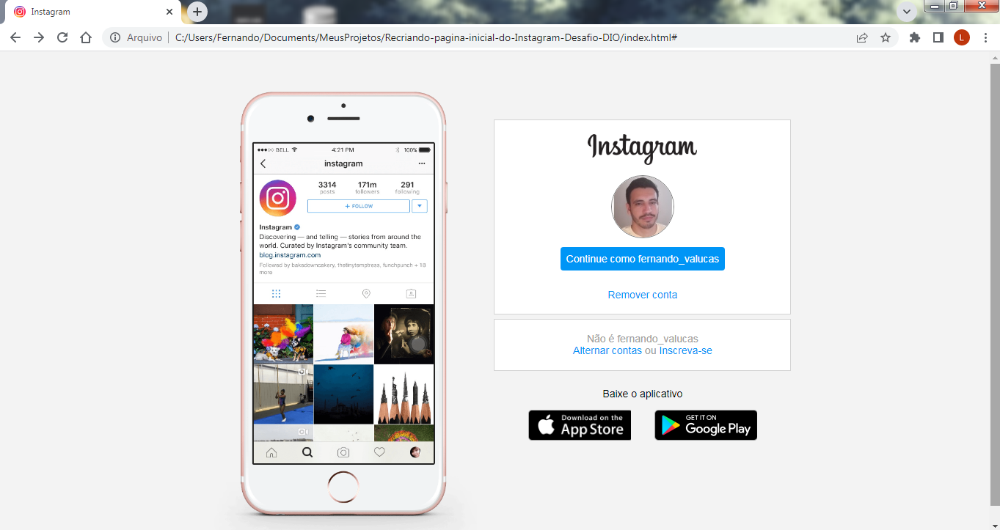

# Recriando-pagina-inicial-do-Instagram-Desafio-DIO
Este projeto é um desafio do Santander Bootcamp Fullstack, que tem como objetivo recriar a página inicial do Instagram.
* Foi utilizado flexbox
* Botões estão funcionais
* Adicionado icone a página

